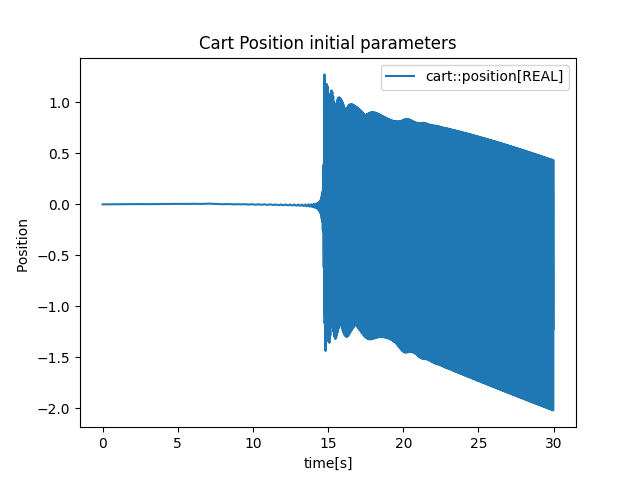
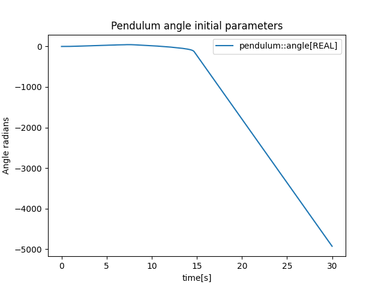
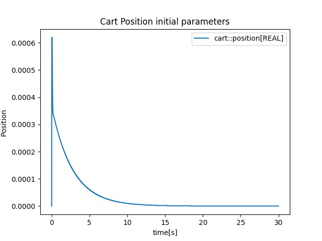
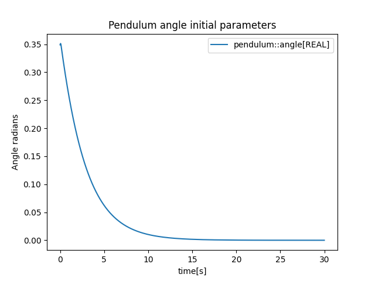

# What is this?
This is a Cosimulation of a Cart, Inverted Pendulum and regulator system with the goal of using the cart to stabilise the angle of the inverted pendulum. 

# How to use

First you have to run the Build.Py file in order to create the 3 FMUS.
Once this is done running the Simulation.py file will run the simulation between the 3 FMUS. In this file you can
change the regulator parameters to tune the system, as well as change the values of the system. 

#### NB: No euler integration is used for the position and velocity of the cart as it made the system too unstable. 

# Results Task 1
The main task was to make a working CoSimulation with 3 FMUS one for the cart, one for the pendulum and the last one for the regulator.
Then we were supposed to run a simulation with the following regulator coefficients:

| Parameter | Value |
|:---------:|:-----:|
| k₁ | -1 |
| k₂ | -2 |
| k₃ | -30 |
| k₄ | -10 |
| θ₀ (initial angle) | 20π/180  |

These images shows the result of the simulation from the initial parameters and we can see that the system itself is unstable. We can fix this by altering some of the regulator parameters.
By changing k_1 and k_2 to -15 we get the following results. 

We can see that the system is now stable and the cart is able to keep the pendulum stable. 